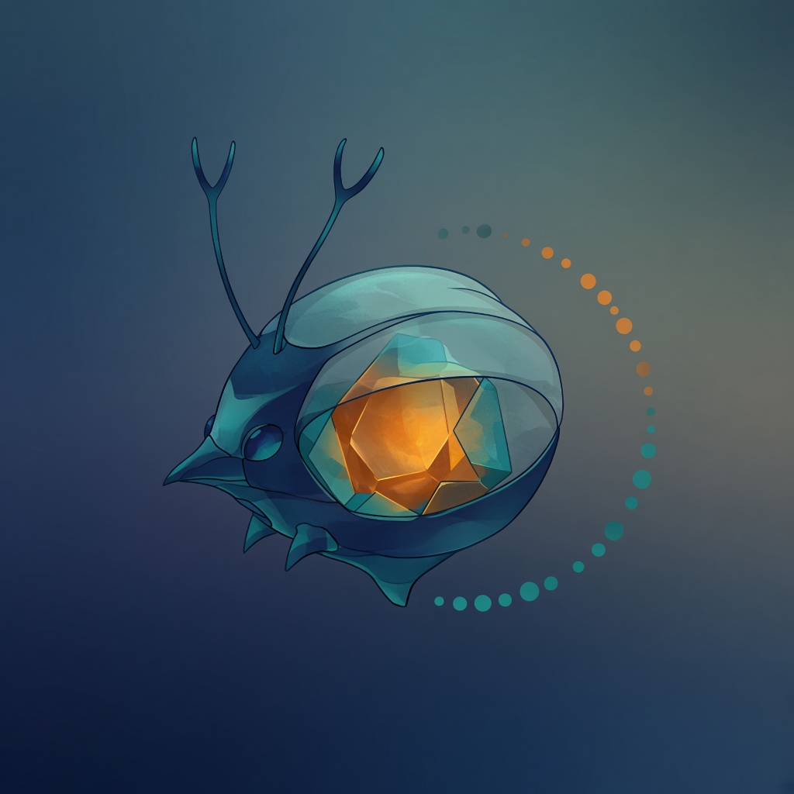

# Retornatus

<p align="center">
  
</p>

<p align="center">
  <strong>Keep AI coding agents honest — with goals, memory, and proof.</strong><br />
  <em>Govern the work. Bound the agent. Verify the outcome.</em>
</p>

<p align="center">
  <a href="https://luizssantiago92.github.io/retornatus/"><strong>Website →</strong></a>
  ·
  <a href="https://luizssantiago92.github.io/retornatus/guide/">Docs</a>
  ·
  <a href="https://luizssantiago92.github.io/retornatus/guide/quick-start.html">Quick start</a>
  ·
  <a href="https://pypi.org/project/retornatus/">PyPI</a>
</p>

[](https://luizssantiago92.github.io/retornatus/)
[](https://pypi.org/project/retornatus/)
[](https://www.python.org/downloads/)
[](https://github.com/luizssantiago92/retornatus/actions/workflows/ci.yml)
[](LICENSE)

## What it is

**Retornatus** is a companion that sits **in your project repository** and helps you run AI coding agents (Cursor, Claude Code, Codex, and similar) with three durable habits:

1. **A clear finish line** before the agent sprints into code  
2. **Memory that survives the chat tab** (intent and progress live in git)  
3. **Proof before “done”** — work closes when evidence matches the goal, not when the model sounds confident  

Your agent still **writes the code**. Retornatus **governs the loop and keeps the record** under `.retornatus/`.

It is **not** an IDE, an LLM runtime, or a marketplace of agents.

---

## What it does for you

| Pain today | With Retornatus |
| --- | --- |
| The agent jumps to code and declares victory | You agree on what “done” means first |
| Each new chat starts from zero | Project memory outlives the session |
| “Done” is a persuasive summary | “Done” needs inspectable evidence |
| Tiny typo and payment change get the same chaos | Ceremony scales with risk |
| Lessons vanish when the tab closes | The next return can learn from the last |

**Day-to-day shape:** you describe what you want → Retornatus helps turn that into a change with an agreed outcome → the agent implements under that agreement → you close when evidence matches the goal → learning stays in the repo.

Conceptual loop (details on the site):

```text
Demand → Situation → Contract → Action → Evidence → Assurance → return informed
```

---

## How it proves work (not just claims it)

Retornatus treats “done” as something you can **check**:

- Goals and constraints are written down (a **contract** for the change)  
- Progress is recorded as **evidence** bound to those goals  
- Closing requires **assurance** — evidence must support the claims, or the gate stops you  

That is how the project stays honest across agents, teammates, and time. Deep mechanics: [docs hub](https://luizssantiago92.github.io/retornatus/guide/).

---

## Install (step by step)

You need **Python 3.11+**. We recommend [`uv`](https://docs.astral.sh/uv/) (fast installer for Python tools). If you do not have `uv` yet:

```bash
# Windows (PowerShell)
powershell -ExecutionPolicy ByPass -c "irm https://astral.sh/uv/install.ps1 | iex"

# macOS / Linux
curl -LsSf https://astral.sh/uv/install.sh | sh
```

Then install Retornatus and prepare **your application repo** (the project you want the agent to work on):

```bash
# 1) Install the Retornatus CLI once on your machine
uv tool install retornatus

# 2) Go to YOUR app (not necessarily this harness repo)
cd /path/to/your-app

# 3) Create .retornatus/ memory + config in this project
retornatus init

# 4) Drop the hub skill into your agent environment (Cursor, etc.)
retornatus integrate

# 5) Sanity check — should report the project as initialized
retornatus doctor
```

What you should see after that:

- a `.retornatus/` folder in the project  
- a hub skill your agent can follow (for example under `.cursor/skills/` on Cursor)  
- `doctor` without hard “not initialized” brakes  

Next: open the project in your AI coding agent and follow the [Quick start](https://luizssantiago92.github.io/retornatus/guide/quick-start.html) to create the first change.

**Also available:** [PyPI package](https://pypi.org/project/retornatus/) · one-shot without global install: `uvx retornatus --help`

---

## What’s new (1.1.x)

- **One-screen progress** — goals, proof, and next steps without digging through chat  
- **Health at a glance** — process care vs hard stops  
- **Lessons that stick** — failed checks can guide the next return  
- **Light hygiene scans** — optional ops loops when you want a checkup  
- **Seedcore** — brand mascot on the site and README  

---

## Documentation

| Want… | Go here |
| --- | --- |
| Product story | [Website](https://luizssantiago92.github.io/retornatus/) |
| First ten minutes | [Quick start](https://luizssantiago92.github.io/retornatus/guide/quick-start.html) |
| Full guide on the site | [Docs hub](https://luizssantiago92.github.io/retornatus/guide/) |
| Concepts overview | [Overview](https://luizssantiago92.github.io/retornatus/guide/overview.html) |
| Product requirements | [PRD](prd/PRD.md) |
| Credits & lineage | [Credits](https://luizssantiago92.github.io/retornatus/credits.html) |

Markdown sources remain under [`docs/guide/`](docs/guide/README.md) for editing; the **website** is the reading experience.

---

## License

MIT — see [LICENSE](LICENSE).

Brand mascot **Seedcore** is an original illustration for Retornatus. Not affiliated with Pokémon or Nintendo.
